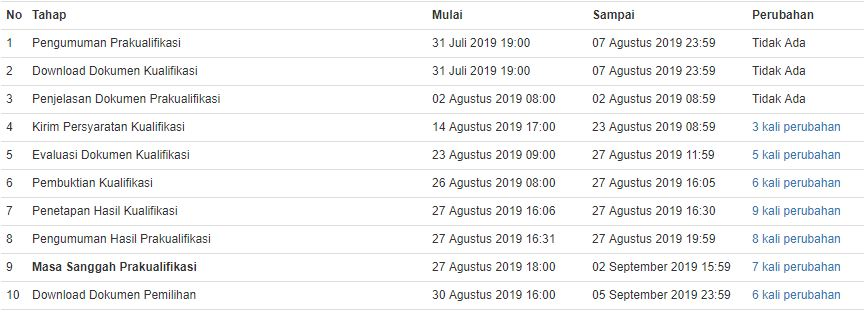

G-MATe
GAIA Management Aptitude Test

Instruksi Umum

Pada halaman-halaman berikut ini Anda akan menemukan sejumlah kondisi yang diikuti dengan pertanyaan mengenai situasi-situasi manajemen terkait dengan kondisi tersebut. 
Jumlah kondisi secara keseluruhan ada 22, setiap kondisi akan diikuti oleh 1 hingga 5 pertanyaan. Total pertanyaan ada 45.
Tugas Anda adalah untuk menilai situasi tersebut dan memberi respon yang menurut Anda tepat untuk situasi atau pertanyaan tersebut, dengan cara memberikan tanda silang ( X ) pada lembar jawab yang telah tersedia. 

Apabila pilihan Anda salah, maka hapuslah pilihan tersebut dan silanglah pada pilihan yang benar.

Anda tidak diperbolehkan membuat coretan apapun dalam buku soal. Anda dapat menggunakan kertas buram untuk membuat catatan, menghitung maupun memperkirakan jawaban yang akan Anda berikan. 

Jika Anda punya pertanyaan, ajukanlah sekarang. Pastikan bahwa Anda sudah memahami instruksi yang ada pada saat mulai mengerjakan. Dalam tugas ini terkandung 45 soal yang membutuhkan waktu selama 75 menit.

Cobalah untuk bekerja secepat dan seakurat mungkin. Jangan terpaku pada 1 soal jika soal tersebut dirasa sulit, cobalah untuk mengerjakan soal lain terlebih dahulu. 

Bukalah halaman berikutnya dan mulailah bekerja.

GANTI HALAMAN
---

Kondisi 1

Divisi Anda telah menunjukkan prestasi terbaik pada tahun ini, dan perusahaan memberikan insentif berupa paket liburan ke sejumlah tujuan wisata dalam dan luar negeri. Biasanya, dalam menentukan siapa yang berhak berwisata di dalam kota, ke luar kota atau yang berhak ke luar negri, tolok ukur utamanya adalah hirarki jabatan dan masa kerja.
Namun Anda berpandangan bahwa prestasi kerja (nilai kinerja) merupakan kriteria utama, diikuti dengan yang kedua: hirarki jabatan, lalu gaji dan yang terakhir masa kerja.
Untuk membantu Anda mengambil keputusan, Anda telah menentukan bahwa prestasi dua kali lebih penting daripada gaji, dan masa kerja hanya setengah pentingnya dari gaji. Jawablah pertanyaan-pertanyaan berikut berdasarkan informasi di bawah ini.

Pertanyaan 1

Jika berwisata ke Taman Bunga Indonusa adalah insentif yang nilainya terendah, kepada siapa saja insentif tersebut akan Anda berikan? 

Pilihan Jawaban

A. Kelly, Sunarto, Chris, Truno

**B. Kelly, Sunarto, Sandra, Chris**

C. Tina, Sunarto, Kelly, Sandra

D. Muladi, Sunarto, Kelly, Truno

E. Kelly, Sandra, Sunarto, Truno

Soal 1

A. dasdasdasdsadsa

B. sdasdadsadsaasd

